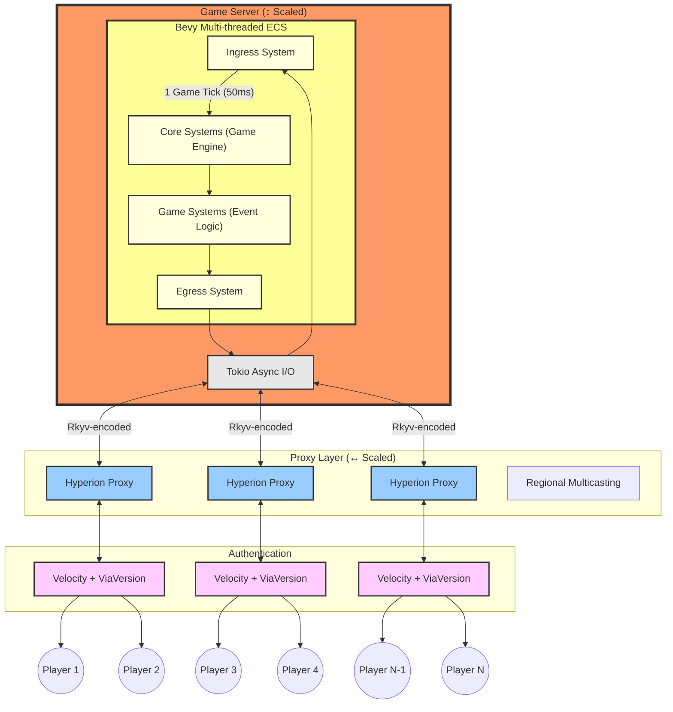
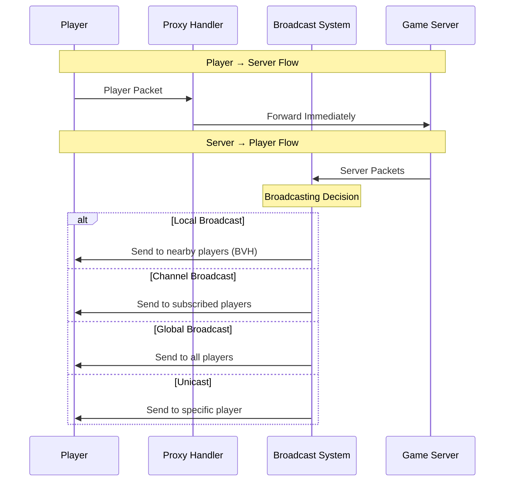

# Contributing to Hyperion

## Table of Contents

- [Getting Involved](#getting-involved)
- [Development Setup](#development-setup)
- [Running for Development](#running-for-development)
- [Production Deployment](#production-deployment)
- [Development Tools](#development-tools)
- [Protocol Documentation](#protocol-documentation)
- [Architecture](#architecture)

## Getting Involved

- Github Issues: [Report bugs, request features, or ask questions](https://github.com/GrandmasterB42/hyperion/issues)

There is currently no Discord or other community chat. If you have questions or want to help out, file an issue and I can look into setting things up.

## Development Setup

### Prerequisites

- The newest nightly version of [Rust](https://www.rust-lang.org/tools/install)
- openssl
- git

## Running for Development

### Clone the repository

```bash
git clone https://github.com/GrandmasterB42/hyperion.git
cd hyperion
```

### Generate keys and certificates

The game server and proxy communicate over mTLS. For local development, you can generate all needed keys in one go. This requires `openssl`.

> [!WARNING]
> All private keys (`.pem` files) must be stored securely. Do not send these private keys to anyone.

```bash
openssl req -new -nodes -newkey rsa:4096 -keyout root_ca.pem -x509 -out root_ca.crt -days 365 -subj /
openssl req -nodes -newkey rsa:4096 -keyout game_private_key.pem -out game.csr -subj /
openssl x509 -req -in game.csr -CA root_ca.crt -CAkey root_ca.pem -CAcreateserial -out game.crt -days 365 -sha256 -extfile <(printf "subjectAltName=DNS:localhost,IP:127.0.0.1")
rm game.csr
openssl req -nodes -newkey rsa:4096 -keyout proxy_private_key.pem -out proxy.csr -subj /
openssl x509 -req -in proxy.csr -CA root_ca.crt -CAkey root_ca.pem -CAcreateserial -out proxy.crt -days 365 -sha256 -extfile <(printf "subjectAltName=DNS:localhost,IP:127.0.0.1")
rm proxy.csr
```

`-days 365` controls how long the certificates are valid. Adjust as needed.

### Start the game server

The game server automatically starts a proxy alongside it:

```bash
cargo run --release --bin bedwars -- --ip 127.0.0.1 --root-ca-cert root_ca.crt --cert game.crt --private-key game_private_key.pem
```

Connect with a Minecraft 1.20.1 client to `127.0.0.1:25565`.

## Production Deployment

### Network topology

Hyperion uses one game server which runs all game logic (physics, events, etc.). One or more proxies can connect to the game server. Players connect to one of the proxies.

In production, the game server and each proxy should run on separate servers for performance.

### Generating keys and certificates

The connection between the game server and the proxies is encrypted with mTLS.

> [!WARNING]
> All private keys (`.pem` files) must be stored securely. It is strongly recommended to generate private keys on the server that will use them rather than transferring them over the network. A compromised key allows a malicious proxy to bypass player authentication and potentially cause undefined behavior on the game server. If any key is compromised, regenerate all keys and certificates.

#### Create a private certificate authority (CA)

Pick a trusted server to act as the CA. Generate a root key and certificate:

```bash
openssl req -new -nodes -newkey rsa:4096 -keyout root_ca.pem -x509 -out root_ca.crt -days 365 -subj /
```

Adjust `-days` as needed.

Copy `root_ca.crt` to the game server and every proxy server.

#### Generate server keys and certificates

Repeat this for the game server and each proxy server.

On the target server, generate a key and CSR:

```bash
openssl req -nodes -newkey rsa:4096 -keyout server_private_key.pem -out server.csr -subj /
```

Transfer `server.csr` to the CA server. On the CA server, sign it:

```bash
openssl x509 -req -in server.csr -CA root_ca.crt -CAkey root_ca.pem -CAcreateserial -out server.crt -days 365 -sha256 -extfile <(printf "subjectAltName=DNS:example.com,IP:127.0.0.1")
```

Replace `example.com` and `127.0.0.1` with the target server's actual domain and IP. Mismatched values will cause connection errors (`invalid peer certificate: certificate not valid for name ...`).

Transfer `server.crt` back to the target server. The `.csr` files can be deleted from both machines.

### Running the proxy

Compile on a machine with Cargo installed (cross-compile if the proxy runs on a different target):

```bash
cargo build --release --bin hyperion-proxy
```

Copy `target/release/hyperion-proxy` to each proxy server and run:

```bash
./hyperion-proxy 0.0.0.0:25565 --server game_server_ip:35565 --root-ca-cert root_ca.crt --cert server.crt --private-key server_private_key.pem
```

Replace `game_server_ip` with the game server's IP or domain (must match the `subjectAltName` in the game server's certificate).

### Running the game server

Compile on the game server (or a machine with the same target):

```bash
cargo build --release --bin bedwars
```

Copy `target/release/bedwars` to the game server and run:

```bash
./bedwars --root-ca-cert root_ca.crt --cert server.crt --private-key server_private_key.pem
```

## Development Tools

### Packet Inspector

[Packet Inspector](https://github.com/valence-rs/valence/tree/main/tools/packet_inspector) (from Valence) lets you inspect Minecraft protocol traffic in real time. Useful when working on packet handling.

### Tracy Profiler

[Tracy](https://github.com/wolfpld/tracy) is a frame profiler. Hyperion has Tracy instrumentation for finding performance bottlenecks.

## Protocol Documentation

Hyperion targets the Minecraft 1.20.1 protocol:

- **Protocol spec**: [Minecraft Protocol Wiki](https://minecraft.wiki/w/Java_Edition_protocol)
- **Valence packet definitions**: [packets.json](https://github.com/valence-rs/valence/blob/8f3f84d557dacddd7faddb2ad724185ecee2e482/tools/packet_inspector/extracted/packets.json) — useful for mapping protocol fields to Valence types

## Architecture

### Overview



### Proxy


